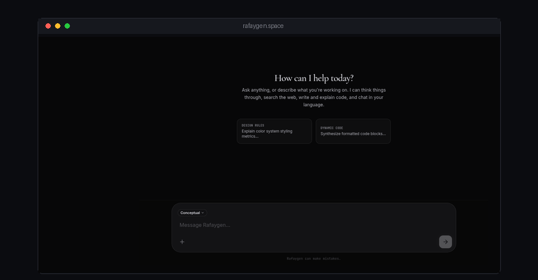
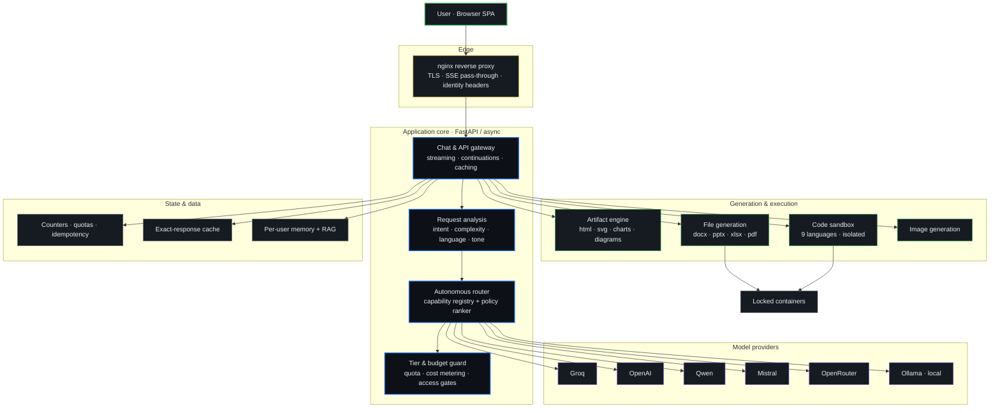
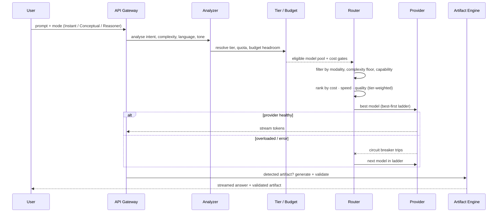
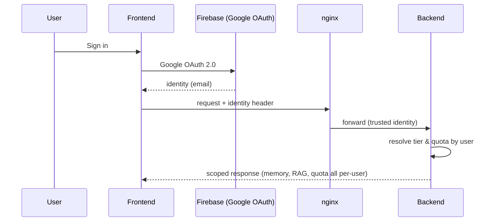

  

# Rafaygen

### A multi-provider, agentic AI workspace — built solo, running in production.

**One chat box. Eleven models across six providers. Autonomous routing. Real artifacts.**

---

## What it is

Most AI chat apps wrap a single model behind a text box. **Rafaygen is an orchestration layer.**

You send one prompt. Rafaygen analyses it — intent, complexity, language, structure, even tone — and **decides on its own** which of eleven models across six providers should answer, balancing cost, speed and quality against your access tier and a live budget. Then it doesn't just reply: it **builds** — runnable code, working web pages, Office documents, charts, diagrams, quizzes — and validates them before they reach you.

It is designed, engineered and shipped end to end by a single developer, and it is live at **[rafaygen.space](https://rafaygen.space)**.

---

## Why it's different

| Ordinary AI chat | Rafaygen |
|---|---|
| One model, one provider | **11 models across 6 providers**, ranked per request |
| You pick the model | **Autonomous router** picks analytically — cost vs speed vs quality vs tier vs budget |
| Returns text | Returns **validated artifacts** — code that runs, files that open, charts that render |
| Fails when the provider is down | **Best-first fallback ladder** + per-provider circuit breakers |
| Flat cost, no control | **Tiered access + per-user quotas + a global budget ceiling** |
| Reasoning models freeze or blank out | Dedicated **reasoning-model pipeline** (effort control, token reserve, thinking stream) |
| No execution | **Sandboxed code execution** (9 languages) + **containerised file generation** |

---

## System architecture

---

## How a request flows

---

## Autonomous routing

The router never asks you to choose a model. It treats model selection as a ranking problem.

```mermaid
flowchart LR
    A["Incoming request"]:::s --> B["Tier gate<br/>eligible models only"]:::s
    B --> C["Budget gate<br/>premium models need headroom"]:::s
    C --> D["Modality filter<br/>text · json · image · tools"]:::s
    D --> E["Complexity floor<br/>weak models dropped on hard asks"]:::s
    E --> F["Capability match<br/>code · math · reasoning · chat"]:::s
    F --> G["Policy rank<br/>cost vs speed vs quality"]:::s
    G --> H["Best-first ladder<br/>+ smooth fallback"]:::win

    classDef s fill:#0d1117,stroke:#1f6feb,color:#e6edf3;
    classDef win fill:#0d1117,stroke:#2ea44f,stroke-width:2px,color:#e6edf3;
```

The **weighting shifts by tier** — a free request leans toward cost and speed; a top-tier request leans toward quality. A live budget signal derates expensive providers as spend climbs, and per-provider circuit breakers pull overloaded lanes out of rotation automatically. *(The exact policy weights and prompt systems are proprietary and kept private.)*

---

## Providers & models

Eleven models, ranked live across six providers:

| Provider | Models | Role |
|---|---|---|
| **Groq** | `llama-3.1-8b-instant`, `llama-3.3-70b-versatile`, `gpt-oss-120b` | Fast, free-tier default |
| **OpenAI** | `gpt-4o-mini`, `gpt-5-mini`*, `o4-mini`* | Premium quality & reasoning |
| **Qwen** | `qwen-flash`, `qwen-max`, `qwen3-max` | Trial-metered balance |
| **Mistral** | `mistral-small`, `mistral-large` | Overflow capacity |
| **OpenRouter** | `deepseek-chat-v3` | Specialty / free lane |
| **Ollama** | local models | Last-resort offline fallback |

*Reasoning models — handled by a dedicated pipeline: reasoning-effort control, token reserve so output never starves, and a separate "thinking" stream so the UI never freezes.

---

## Modes & complexity

Three modes sit on top of automatic analysis:

| Mode | Behaviour |
|---|---|
| **Instant** | Forces the fastest lightweight model — snappy replies |
| **Conceptual** *(default)* | Full automatic routing — the system decides |
| **Reasoner** | Forces the strongest deep-reasoning path |

Under the hood every request is also scored on a **1–5 complexity scale** from length, code/markup density, structure and intent — which floors out weak models on hard asks and saves cost on trivial ones.

---

## What it builds — artifacts

| Artifact | Rendered |
|---|---|
| **Web pages** — HTML + CSS + JS | Live in-chat |
| **Interactive 3D** — WebGL scenes | Live in-chat |
| **Charts** — scientific, function, statistical | Live in-chat |
| **Diagrams** — flow, UML, sequence, state, C4 | Live in-chat |
| **Quizzes & flashcards** — interactive, scored | Live in-chat |
| **Office files** — DOCX · PPTX · XLSX · PDF · CSV | **Generated & validated server-side** |
| **Runnable code** — 9 languages | **Executed in a sandbox** |
| **Images** — text-to-image, restyle, upscale | Server-side |

Every server-side file is opened with a real library before delivery — you never receive a corrupt document.

---

## Tiers & cost control

Access and spend are governed per user:

| Tier | Quota / month | Routing bias |
|---|---|---|
| **Free** | guest | cost & speed |
| **Go** | 100 | cost-aware |
| **Plus** | 150 | quality-leaning |
| **Extreme** | 200 | quality-first (reasoning) |

A **global monthly budget ceiling** caps total provider spend. When budget runs low the system can silently fall back to free models, or notify the user — without ever breaking the conversation. Premium models are only reached when both tier access **and** budget headroom allow.

---

## Authentication & identity

Identity is **stateless and header-based** — no session cookies. Sign-in is Google OAuth via Firebase; per-user memory, documents and quotas are scoped to the authenticated identity. Administrative routes are protected by a separate secret token.

---

## Code execution & file generation

Both run in **locked Docker containers**, never on the host:

- **No network**, read-only filesystem, all Linux capabilities dropped, non-root user
- Per-language memory / CPU / process limits; hard timeouts; output size caps
- Code sandbox supports **Python, JavaScript, TypeScript, Ruby, PHP, Go, C, C++, Bash**
- File generation runs in an ephemeral workspace and every output is **schema-validated** with a real parser before it's returned

Code generation additionally runs a **verify loop**: static check → execute → compare output → auto-fix (bounded retries) before anything ships.

---

## API surface

A REST + streaming API, including an **OpenAI-compatible lane** so existing tooling works unchanged:

| Area | Representative endpoints |
|---|---|
| **Chat** | `POST /api/external/chat` · `POST /api/external/enhance` |
| **OpenAI-compatible** | `GET /v1/models` · `POST /v1/chat/completions` · `/v1/images/generations` · `/v1/audio/{speech,transcriptions}` |
| **Execution** | `POST /api/execute` · `POST /api/execute/stream` · `GET /api/execute/info` |
| **File generation** | `POST /api/filegen/generate` · `POST /api/artifact/export` · `POST /api/codegen/verify` |
| **Tiers & quota** | `GET /api/tiers/status` · `GET /api/quota` · `GET /api/user/provider-options` |
| **Memory & RAG** | `POST /api/ingest` · `GET /api/rag/docs` · `GET /api/memory` |
| **Media** | `POST /api/image/generate` · `POST /api/tts/edge` · `GET /api/tts/voices` |
| **Admin** | `GET /api/admin/router` · `POST /api/admin/provider-matrix` · `POST /api/admin/tiers` |
| **Health** | `GET /health` · `GET /ready` · `GET /health/deep` |

---

## Tech & deployment

- **Backend** — FastAPI (async), pooled `httpx`, server-sent-event streaming, continuation stitching, exact-response cache
- **Frontend** — React + TypeScript + Vite SPA, hashed immutable assets
- **Edge** — nginx reverse proxy with SSE pass-through and forwarded identity
- **Execution** — Docker-isolated sandbox + file-generation containers
- **Auth & data** — Firebase (Google OAuth + per-user store); key-value counters, quotas and idempotency
- **Observability** — trace IDs, per-request telemetry (intent, model, latency), circuit breakers, a ring buffer of recent routing decisions

---

## About this repository

This is the **public showcase** for Rafaygen. The application source code — the router internals, prompt systems, generation pipelines and policy weights — is **proprietary and kept in a private repository**. This page documents *what* the system is and *how* it is built, without exposing the implementation.

### [Try it live — rafaygen.space](https://rafaygen.space)

**Designed, engineered and shipped solo — end to end.**

© 2026 Rafay · All rights reserved · See [LICENSE](LICENSE)

