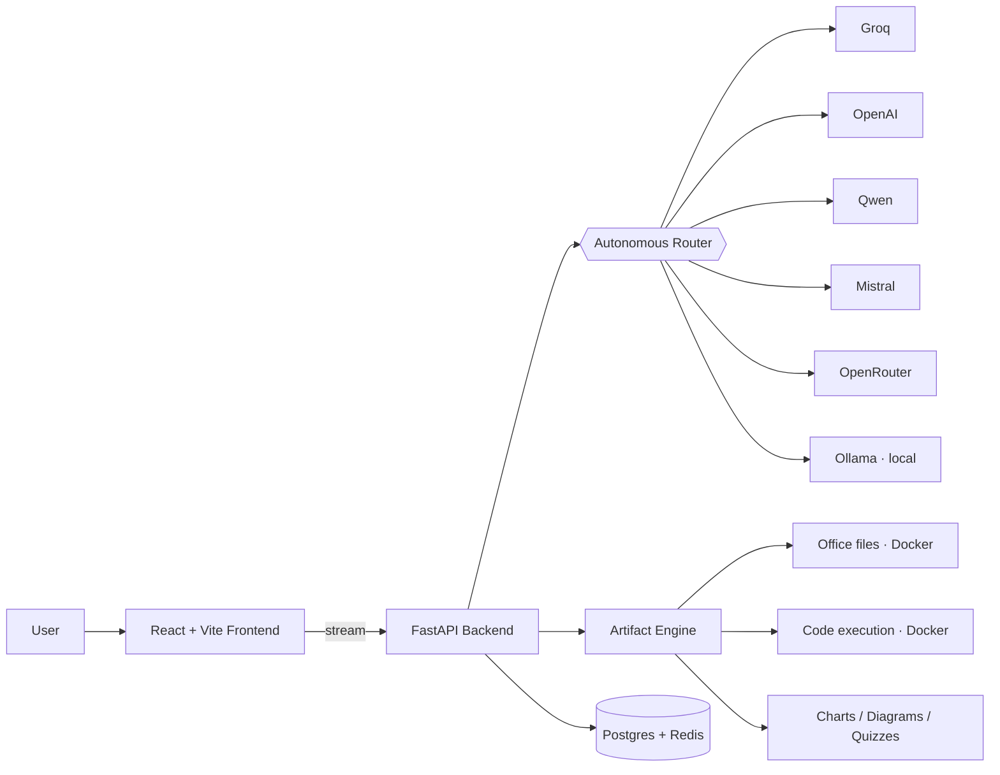

# 🧠 Rafaygen

### A multi-provider, agentic AI workspace — built solo.

**One chat box. Many models. Autonomous routing. Real artifacts.**

[**🚀 Try it live → rafaygen.cloud**](https://rafaygen.cloud)

---

> Rafaygen is a production AI workspace that picks the right model for every
> request on its own, then doesn't just *talk* — it **builds**. Working web
> pages, spreadsheets, slide decks, diagrams, charts, quizzes, runnable code in
> 8 languages — all generated inline and rendered live in the browser.
>
> Designed, engineered, and shipped end-to-end by a single developer.

---

## ✨ What it actually does (all live in production)

### 🔀 Autonomous multi-provider routing
Bring a prompt — Rafaygen decides which provider and model fits it best across
**Groq, OpenAI, Qwen, Mistral, OpenRouter, and local Ollama**, balancing speed,
quality, and cost. No manual model-picking required (though you can override).

### 🧩 It builds, not just chats — inline artifacts
| Artifact | What you get |
|---|---|
| 🌐 **Web pages** | Full HTML + Tailwind + React/JSX, rendered & editable live |
| 📊 **Office files** | XLSX, DOCX, PPTX, PDF — generated server-side, downloadable |
| 📈 **Charts** | Bar, line, pie, scatter — streaming-safe, rendered inline |
| 🔷 **Diagrams** | Mermaid: flowcharts, UML, sequence, state, C4 architecture |
| 🎴 **Flashcards** | Flip-animated, persistent study decks |
| ❓ **Quizzes** | Interactive, auto-scored |
| 🎨 **SVG** | Inline vector graphics |
| 🖼️ **Images** | GPU image generation |

### 💻 Coding Sandbox
A real editor that **executes code in an isolated Docker sandbox** across
**Python, JavaScript, TypeScript, Ruby, PHP, Go, C, C++, and Bash** — with an
automatic debug-and-fix loop.

### 🎬 Creative Director
A guided campaign-brief builder that turns a few inputs into polished creative output.

### 🎙️ Voice
Speak your prompt (speech-to-text) and have any answer read back aloud (text-to-speech).

### 🎚️ Plans & tiers
Built-in tiered access with per-user quotas and budget controls.

---

## 🏗️ Architecture (high level)

> The diagram shows the *shape* of the system. The routing intelligence,
> prompt engineering, and generation pipelines are proprietary and live in a
> private repository.

---

## 🛠️ Tech stack

**Frontend** · React 18 · TypeScript · Vite · Tailwind CSS · streaming SSE
**Backend** · Python · FastAPI · httpx · async streaming
**Data** · PostgreSQL · Redis
**Execution** · Docker-isolated sandboxes
**AI** · Groq · OpenAI · Qwen · Mistral · OpenRouter · Ollama

---

## 📦 About this repository

This is the **public showcase** for Rafaygen. The application source code —
the router, the generation pipelines, the prompt systems — is **proprietary and
kept private**. This repo exists to document what Rafaygen is and what it can do.

See the app for yourself: **[rafaygen.cloud](https://rafaygen.cloud)**

---

**Built solo by [Rafay](https://github.com/rafay0342).**

*Multi-provider orchestration · agentic routing · real artifact generation — one person, end to end.*

© 2026 Rafay / WaveTech Limited · All rights reserved · See [LICENSE](LICENSE)

